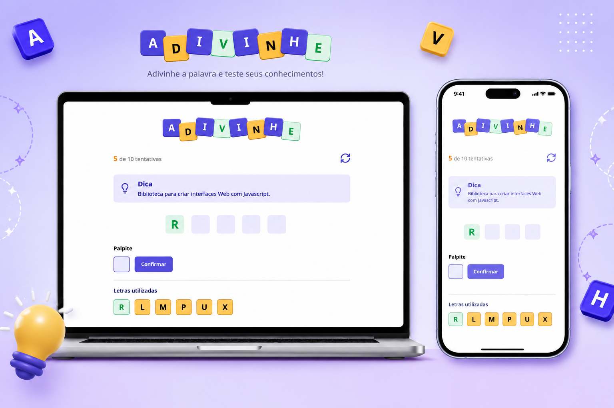

<h1 align="center">Adivinhe</h1>

  <a href="#-o-projeto">O Projeto</a>&nbsp;&nbsp;&nbsp;|&nbsp;&nbsp;&nbsp;
  <a href="#-tecnologias">Tecnologias</a>&nbsp;&nbsp;&nbsp;|&nbsp;&nbsp;&nbsp;
  <a href="#-ferramentas">Ferramentas</a>&nbsp;&nbsp;&nbsp;|&nbsp;&nbsp;&nbsp;
  <a href="#-layout">Layout</a>

  

## 💻 O Projeto

**Adivinhe** é um jogo de adivinhação de palavras do universo da programação. A cada rodada, o jogador recebe uma dica e deve descobrir a palavra oculta digitando uma letra por vez — antes de esgotar o limite de tentativas.

Os principais destaques do desenvolvimento incluem:

1. **Componentização da interface:** A aplicação foi dividida em componentes reutilizáveis como `Header`, `Tip`, `Letter`, `Input`, `Button` e `LettersUsed`, tornando o código mais organizado, modular e fácil de manter.
2. **Gerenciamento de estado com React Hooks:** Múltiplos `useState` controlam os dados do jogo (palavra sorteada, letras utilizadas, pontuação), enquanto `useEffect` é utilizado para inicializar a partida e reagir às alterações de estado quando necessário.
3. **CSS Modules para isolamento de estilos:** Cada componente possui seu próprio arquivo `.module.css`, garantindo escopo de estilos sem conflitos e tornando a manutenção do visual mais organizada.
4. **TypeScript com tipos customizados:** Interfaces como `Challenge` e `LettersUsedProps` garantem tipagem segura em todo o fluxo da aplicação, desde o banco de palavras até os componentes responsáveis pela exibição das informações.

## 🚀 Tecnologias

* **React:** Criação da interface com componentes reutilizáveis (`Header`, `Tip`, `Letter`, `Input`, `Button`, `LettersUsed`) e controle da lógica do jogo com `useState` e `useEffect`.
* **TypeScript:** Tipagem estática com tipos e interfaces customizados para os dados do jogo, evitando erros em tempo de desenvolvimento.
* **CSS:** Responsável pela estilização da interface e experiência visual da aplicação.
* **Vite:** Configuração do ambiente de desenvolvimento e build da aplicação.

## 🛠️ Ferramentas
* **Git & GitHub:** Versionamento e deploy da aplicação.

## 🔖 Layout

Você pode visualizar e interagir com o projeto através dos links abaixo:

* 👉 **[Acesse o site funcionando aqui](https://alissonfa-adivinhe.vercel.app/)**
* 📲 **[Acesse o layout original do projeto aqui](https://www.figma.com/community/file/1453366829725330797)**

**Para rodar no seu computador (Local):**
1. Faça o download ou clone o repositório.
2. Na raiz do projeto, instale as dependências com `npm install`.
3. Inicie o servidor de desenvolvimento com `npm run dev` e acesse `http://localhost:5173`.

---

Feito com 💜 por **[AlissonFA](https://www.linkedin.com/in/alissonfa/)**